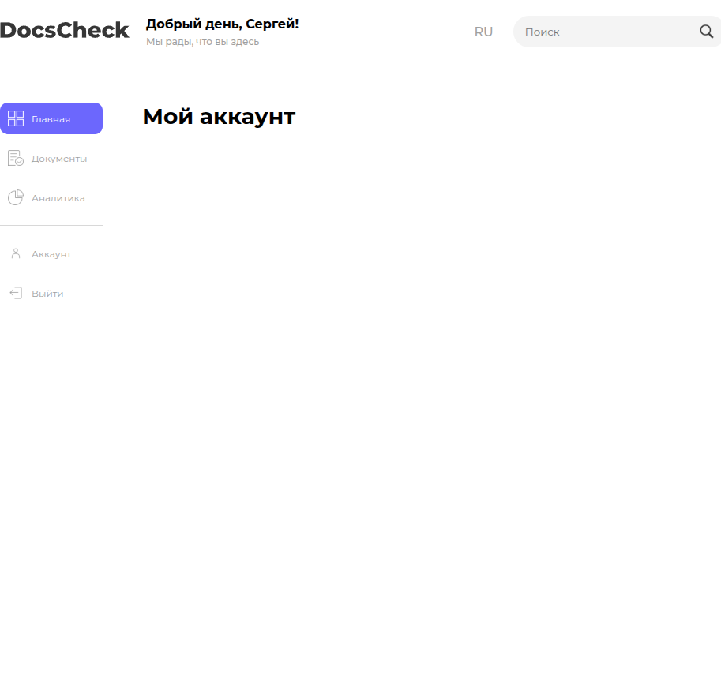

# Инструкция администратора Dokkee

Инструкция для технического администратора, который отвечает за работу сервиса в организации: управление ключами DeepSeek, мониторинг контейнеров, ротация секретов, бэкап пользовательских данных, реакция на инциденты.

Документ предполагает, что фронтенд уже развёрнут по [DEPLOYMENT.md](DEPLOYMENT.md). По регламенту разработки см. [MAINTENANCE.md](MAINTENANCE.md).

## Содержание

1. [Роли и доступы](#1-роли-и-доступы)
2. [Управление ключом DeepSeek](#2-управление-ключом-deepseek)
3. [Мониторинг Docker-сервисов](#3-мониторинг-docker-сервисов)
4. [Управление пользователями](#4-управление-пользователями)
5. [Бэкапы и хранение данных](#5-бэкапы-и-хранение-данных)
6. [Инциденты и план реагирования](#6-инциденты-и-план-реагирования)
7. [Аудит безопасности](#7-аудит-безопасности)
8. [План доработок инфраструктуры](#8-план-доработок-инфраструктуры)

---

## 1. Роли и доступы

| Роль | Зона ответственности | Доступы |
|------|---------------------|---------|
| **Администратор** | Ключи, контейнеры, мониторинг, инциденты | SSH к prod-серверу, аккаунт DeepSeek, GitHub repo admin |
| **Разработчик** | Код, ревью, тесты | GitHub repo write, dev-окружение |
| **Пользователь** | Загрузка документов, анализ | UI без админ-функций |

В UI приложения раздел **"Аккаунт"** сейчас представлен заглушкой — поле под расширение (имя, тариф, лимиты памяти, выход).



Когда подключится бэкенд авторизации, в этом разделе появятся: смена пароля, 2FA, история действий, управление сессиями. На текущем этапе администратор регулирует доступ на уровне инфраструктуры (DNS, VPN, basic-auth nginx).

## 2. Управление ключом DeepSeek

### Получение

1. Зайти на [platform.deepseek.com](https://platform.deepseek.com/).
2. Создать API-ключ с понятным меткой (например, `dokkee-prod-2026-05`).
3. Скопировать ключ в защищённое хранилище (Vault, Bitwarden, 1Password).

### Внедрение в сборку

Ключ задаётся переменной `VUE_APP_DEEPSEEK_KEY` на этапе `npm run build`. Способы:

**Из CI** (рекомендуется):

```yaml
# .github/workflows/deploy.yml (рекомендация, в репозитории отсутствует)
- name: Build
  env:
      VUE_APP_DEEPSEEK_KEY: ${{ secrets.DEEPSEEK_KEY }}
  run: npm run build
```

**Из консоли** (для ручных релизов):

```bash
VUE_APP_DEEPSEEK_KEY="sk-..." npm run build
```

### Ротация

Регламент — раз в 90 дней или при инциденте. Алгоритм:

1. Создать новый ключ в кабинете DeepSeek.
2. Обновить переменную в CI / Vault.
3. Запустить деплой с новым бандлом.
4. Дождаться раскатки (npm run build + nginx reload).
5. Отозвать старый ключ в кабинете DeepSeek.
6. Зафиксировать ротацию в `CHANGELOG.md` (только дата и метка ключа, **сам ключ не пишется**).

> **Известный технический долг.** Старый ключ DeepSeek (`sk-95a2138d...`) попал в первые коммиты репозитория. История не переписывалась. Если используется живой ключ — он скомпрометирован. Этот ключ должен быть отозван **прямо сейчас**, если ещё активен.

### Защита ключа от утечки во фронт

Префикс `VUE_APP_*` Vue CLI впекает значение в публичный бандл. Любой пользователь сайта может извлечь ключ через DevTools -> Sources -> поиск по `sk-`. Для public-deployment это **неприемлемо**.

Решение — backend-прокси (рекомендация на доработку):

```
Browser -> Nginx -> Backend-proxy -> api.deepseek.com
                          ^
                  хранит ключ в env, аутентифицирует пользователя
```

См. [DEPLOYMENT.md §5](DEPLOYMENT.md#5-production-сборка) для архитектурной схемы.

## 3. Мониторинг Docker-сервисов

### Базовые команды

```bash
docker compose ps                      # статус всех сервисов
docker compose logs -f frontend        # логи dev-сервера
docker compose logs -f test-unit       # логи vitest в watch
docker compose stats                   # потребление CPU/RAM
```

### Healthcheck

Сервис `frontend` имеет встроенный healthcheck:

```yaml
healthcheck:
    test: ["CMD", "wget", "-qO-", "http://127.0.0.1:8080"]
    interval: 5s
    timeout: 3s
    retries: 30
    start_period: 30s
```

Статусы:

- `starting` — в течение `start_period`, ещё считается живым.
- `healthy` — последний healthcheck успешный.
- `unhealthy` — N подряд провалов. Контейнер не убивается, но `depends_on: condition: service_healthy` его не пустит.

### Метрики

Внешний мониторинг не настроен. Минимальный вариант — добавить `cAdvisor` + `Prometheus` + `Grafana` (рекомендация на доработку). Что отслеживать:

- CPU/RAM контейнеров (`frontend` обычно <500MB, скачки выше — повод проверить hot reload).
- Доступность `/` через nginx (uptime monitoring: Uptime Kuma, BetterStack).
- Внешний http-чек `https://dokkee.example.com/` каждые 1-5 минут.

## 4. Управление пользователями

На текущем этапе **встроенной системы пользователей нет** — все данные хранятся в браузере (Pinia store, localStorage не используется). Это значит:

- Документы и риски **не передаются между устройствами**.
- Очистка кэша браузера = потеря истории.
- Аутентификация **на уровне инфраструктуры**: VPN, Cloudflare Access, basic-auth nginx.

### Basic-auth nginx (быстрая защита)

```bash
sudo apt install apache2-utils
sudo htpasswd -c /etc/nginx/.htpasswd dokkee_admin
```

В nginx-конфиге:

```nginx
location / {
    auth_basic           "Dokkee";
    auth_basic_user_file /etc/nginx/.htpasswd;
    try_files $uri $uri/ /index.html;
}
```

Когда появится бэкенд авторизации — переключиться на полноценный SSO (Keycloak / Authentik / OAuth) и убрать basic-auth.

## 5. Бэкапы и хранение данных

### Что бэкапим

| Объект | Где лежит | Как бэкапить |
|--------|-----------|--------------|
| Исходный код | Git | GitHub + локальный mirror |
| Production-бандл | `/var/www/dokkee/dist/` | `rsync` в `releases/` с timestamp |
| Nginx-конфиг | `/etc/nginx/sites-available/dokkee` | Git config repo |
| SSL-сертификаты | `/etc/letsencrypt/` | Системный бэкап (`rsnapshot` / `restic`) |
| Документы пользователя | **Браузер пользователя** | Не бэкапятся (нет серверного хранилища) |

### Восстановление сайта

```bash
# Возврат к предыдущей версии бандла
ssh deploy@server
cd /var/www/dokkee
ls -la releases/                        # выбрать предыдущий релиз
ln -snf releases/2026-05-10-14-32 dist
sudo systemctl reload nginx
```

Время восстановления — секунды (симлинк-переключение).

## 6. Инциденты и план реагирования

### Уровни инцидентов

| Уровень | Признаки | SLA реакции |
|---------|----------|-------------|
| **P1**  | Сайт недоступен, 500/502/504 | 15 минут |
| **P2**  | Анализ не работает (DeepSeek 401/429/500) | 1 час |
| **P3**  | Деградация (медленные ответы, частичные ошибки) | 4 часа |
| **P4**  | Косметика, UX-баги | следующий релиз |

### Плейбуки

**Сайт упал (P1):**

1. `curl -I https://dokkee.example.com/` — что отдаёт.
2. `ssh deploy@server "sudo systemctl status nginx && nginx -t"`.
3. Проверить SSL: `openssl s_client -connect dokkee.example.com:443 -servername dokkee.example.com`.
4. Если nginx OK — проверить контейнер `docker compose ps`.
5. Если nginx упал — `sudo systemctl restart nginx`.
6. После восстановления — postmortem в issue.

**DeepSeek 401 (P2):**

1. Проверить статус ключа в кабинете DeepSeek (не отозван? не истёк?).
2. Проверить, что бандл содержит актуальный ключ (`grep -o 'sk-[a-zA-Z0-9]*' /var/www/dokkee/dist/js/*.js | head -1`).
3. Если ключ в бандле старый — пересобрать с новой переменной и задеплоить.

**DeepSeek 429 (rate limit, P2):**

1. Проверить лимит в DeepSeek-кабинете.
2. Включить (если не включена) клиентскую очередь / debounce запросов.
3. Если устойчивый паттерн — увеличить тариф или добавить кеш повторяющихся анализов.

## 7. Аудит безопасности

### Регулярный чек-лист (раз в квартал)

- [ ] `npm audit` — нет high/critical уязвимостей.
- [ ] Docker-образы пересобраны на свежий `node:20-alpine` (есть CVE-патчи).
- [ ] SSL-сертификаты Let's Encrypt автообновляются (`certbot renew --dry-run`).
- [ ] HTTP-заголовки безопасности отдаются: `X-Frame-Options`, `X-Content-Type-Options`, `Referrer-Policy`, `Strict-Transport-Security`. Проверка — [securityheaders.com](https://securityheaders.com/).
- [ ] Старый ключ DeepSeek из истории git отозван.
- [ ] Доступы к серверу: SSH-ключи актуальны, отозвавшихся сотрудников удалить.

### Чувствительные данные

Документы пользователей **не отправляются** на наш сервер — хранятся в браузере. На DeepSeek уходит **только извлечённый текст** документа (без файла) — это упоминается в политике, но пользователь должен знать. Если документы содержат **персональные данные** клиентов или **коммерческую тайну** — обсудить с юристами, можно ли использовать стороннюю модель.

## 8. План доработок инфраструктуры

Текущая архитектура — MVP. Перед публичным запуском нужно закрыть как минимум:

1. **Backend-прокси для DeepSeek-ключа.** Сейчас ключ во фронт-бандле — компрометация при первом же открытии сайта.
2. **Серверная авторизация пользователей.** Сейчас разделение только по инфраструктурному basic-auth / VPN.
3. **Серверное хранилище документов.** Сейчас всё в браузере — потеря при чистке кэша, нет sync между устройствами.
4. **Sentry / GlitchTip** для клиентских ошибок. Сейчас падения видит только пользователь.
5. **CI/CD pipeline** с автоматической сборкой и деплоем. Сейчас сборка ручная.
6. **Мониторинг** (Prometheus + Grafana или внешний Uptime Kuma).
7. **CHANGELOG.md** с привязкой к семантическим версиям.
8. **Перепись истории git** для удаления скомпрометированного ключа DeepSeek (`git filter-repo`).

Эти задачи следует приоритизировать в отдельном эпике и проработать с командой разработки.
