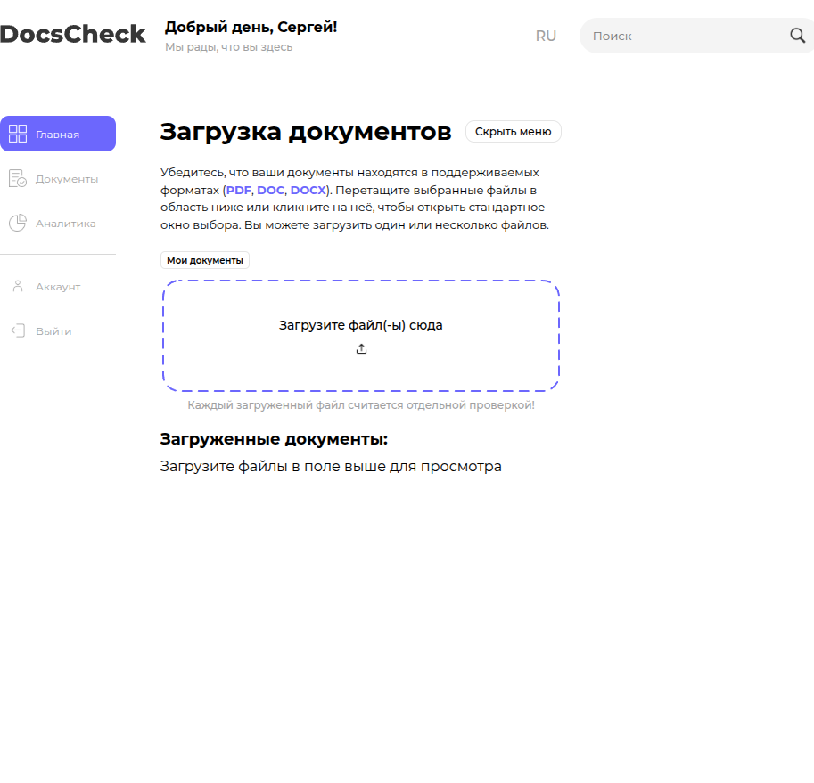

# Инструкция по развертыванию фронтенда Dokkee

Документ описывает развертывание фронтенд-приложения Dokkee в трёх режимах:

- **Локальная разработка** — `npm run serve` (hot reload).
- **Локальный Docker** — `docker compose` (контейнер с dev-сервером + watch-тесты).
- **Production** — статическая сборка `npm run build` + раздача через nginx.

Бэкенда в проекте нет: запросы к DeepSeek идут напрямую из браузера, потому для production требуется только статика и обратный прокси.

## Содержание

1. [Требования к среде](#1-требования-к-среде)
2. [Переменные окружения](#2-переменные-окружения)
3. [Локальный запуск через npm](#3-локальный-запуск-через-npm)
4. [Локальный запуск через Docker](#4-локальный-запуск-через-docker)
5. [Production-сборка](#5-production-сборка)
6. [Раздача через nginx](#6-раздача-через-nginx)
7. [Развертывание в Docker (production)](#7-развертывание-в-docker-production)
8. [Проверка после развертывания](#8-проверка-после-развертывания)

---

## 1. Требования к среде

| Компонент | Версия | Назначение |
|-----------|--------|------------|
| Node.js   | 20.x LTS (Alpine в Docker) | Сборка и dev-сервер |
| npm       | 10.x   | Менеджер пакетов |
| Docker    | 24+    | Опционально, контейнерный запуск |
| Docker Compose | v2 | Опционально, оркестрация |
| Браузер   | Chromium 120+, Firefox 120+, Safari 17+ | Pdf.js v5, ESM |

Для production достаточно nginx 1.24+ или любого статик-сервера с поддержкой gzip/brotli и `Cache-Control`.

## 2. Переменные окружения

Файл `.env.example` содержит шаблон. Скопируйте в `.env` и заполните:

```bash
cp .env.example .env
```

| Переменная | Обязательная | Описание |
|-----------|--------------|----------|
| `VUE_APP_DEEPSEEK_KEY` | Да | API-ключ DeepSeek. Без него анализ упадёт с понятной ошибкой. |
| `CHOKIDAR_USEPOLLING` | Нет | `true` для watch внутри Docker-volume. |
| `HOST` | Нет | Адрес bind dev-сервера (`0.0.0.0` для Docker). |
| `PORT` | Нет | Порт dev-сервера (по умолчанию `8080`). |
| `BASE_URL` | Нет | Базовый URL для Playwright E2E. |

> **Безопасность.** Префикс `VUE_APP_*` означает, что переменная попадает в клиентский бандл и видна в исходниках браузера. Не размещайте production-ключ DeepSeek во фронте без прокси: см. раздел [Production-сборка](#5-production-сборка).

## 3. Локальный запуск через npm

```bash
git clone <repo-url>
cd dokkee-front
cp .env.example .env
# отредактировать .env, проставить VUE_APP_DEEPSEEK_KEY
npm install
npm run serve
```

Сервер слушает `http://localhost:8080` с hot reload. После старта откройте браузер — должна загрузиться главная страница.



## 4. Локальный запуск через Docker

```bash
cp .env.example .env
export VUE_APP_DEEPSEEK_KEY="sk-..."   # либо положить в .env
docker compose up -d frontend
```

Контейнер `dokkee-frontend` имеет `healthcheck` через `wget http://127.0.0.1:8080`. Дождитесь статуса `healthy`:

```bash
docker compose ps frontend
```

Сервисы `test-unit`, `test-lint`, `test-e2e` запускаются автоматически вместе с frontend и работают в watch-режиме. Если они не нужны — стартуйте только `frontend`:

```bash
docker compose up -d frontend
```

Логи:

```bash
docker compose logs -f frontend
```

## 5. Production-сборка

Сборка статики:

```bash
VUE_APP_DEEPSEEK_KEY="sk-..." npm run build
```

Артефакты появятся в `dist/`. Это статический сайт: `index.html`, чанки JS/CSS, ассеты.

> **Внимание.** Ключ DeepSeek встраивается в бандл на этапе сборки. Для публичного развертывания используйте серверный прокси (Nginx + auth-token, либо отдельный backend-эндпоинт). Прямой ключ в production-бандле — это компрометация ключа всем посетителям сайта.

Рекомендуемая схема для production:

```
Browser  ->  Nginx (статика + /api/* прокси)  ->  Backend-proxy  ->  api.deepseek.com
                                                         ^
                                                  хранит ключ DeepSeek
```

Backend-proxy не входит в текущий репозиторий и не реализован — это **рекомендация на доработку** перед публичным запуском.

## 6. Раздача через nginx

Минимальный конфиг для статики `dist/`:

```nginx
server {
    listen 443 ssl http2;
    server_name dokkee.example.com;

    ssl_certificate     /etc/letsencrypt/live/dokkee.example.com/fullchain.pem;
    ssl_certificate_key /etc/letsencrypt/live/dokkee.example.com/privkey.pem;

    root /var/www/dokkee/dist;
    index index.html;

    gzip on;
    gzip_types text/plain text/css application/javascript application/json image/svg+xml;
    gzip_min_length 1024;

    # SPA-fallback: vue-router в режиме history требует отдавать index.html для любых путей.
    location / {
        try_files $uri $uri/ /index.html;
    }

    # Долгий кэш для хеш-чанков.
    location ~* \.(js|css|woff2|svg|png|jpg)$ {
        expires 30d;
        add_header Cache-Control "public, immutable";
    }

    add_header X-Frame-Options "DENY";
    add_header X-Content-Type-Options "nosniff";
    add_header Referrer-Policy "strict-origin-when-cross-origin";
}

server {
    listen 80;
    server_name dokkee.example.com;
    return 301 https://$host$request_uri;
}
```

Деплой:

```bash
rsync -av --delete dist/ deploy@server:/var/www/dokkee/dist/
ssh deploy@server "sudo nginx -t && sudo systemctl reload nginx"
```

## 7. Развертывание в Docker (production)

В текущем `Dockerfile` определены только стадии `deps`, `dev`, `test`, `e2e`. Production-стадия отсутствует. Ниже — рекомендуемый Dockerfile для production-сборки (требует доработки и проверки перед использованием):

```dockerfile
# Production stage (рекомендация, в репозитории отсутствует)
FROM deps AS build
COPY . .
ARG VUE_APP_DEEPSEEK_KEY
ENV VUE_APP_DEEPSEEK_KEY=$VUE_APP_DEEPSEEK_KEY
RUN npm run build

FROM nginx:1.27-alpine AS production
COPY --from=build /app/dist /usr/share/nginx/html
COPY deploy/nginx.conf /etc/nginx/conf.d/default.conf
EXPOSE 80
HEALTHCHECK --interval=15s --timeout=3s CMD wget -qO- http://127.0.0.1/ || exit 1
USER nginx
```

Сборка и запуск:

```bash
docker build --target production --build-arg VUE_APP_DEEPSEEK_KEY="$KEY" -t dokkee-front:prod .
docker run -d --name dokkee-prod -p 80:80 dokkee-front:prod
```

## 8. Проверка после развертывания

Чек-лист после развертывания:

- [ ] `https://<domain>/` отдаёт главную страницу (HTTP 200).
- [ ] DevTools -> Network: бандл `app.<hash>.js` загружается без ошибок CORS/MIME.
- [ ] Загрузка PDF/DOCX отображает превью.
- [ ] Запуск анализа: запрос на `api.deepseek.com/v1/chat/completions` уходит и возвращает 200.
- [ ] Подсветка рисков появляется на превью после завершения анализа.
- [ ] В консоли нет ошибок `Cannot find module 'pdfjs-dist/...'` (типичная проблема при кешировании старого бандла).

Откатить релиз — заменой `dist/` на предыдущую версию (рекомендуется хранить N последних артефактов в `/var/www/dokkee/releases/` и переключать симлинк).
