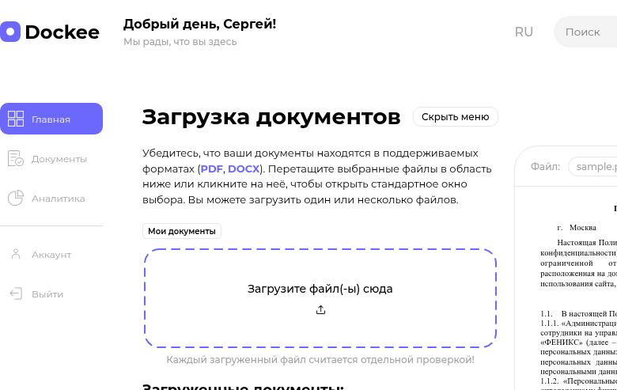
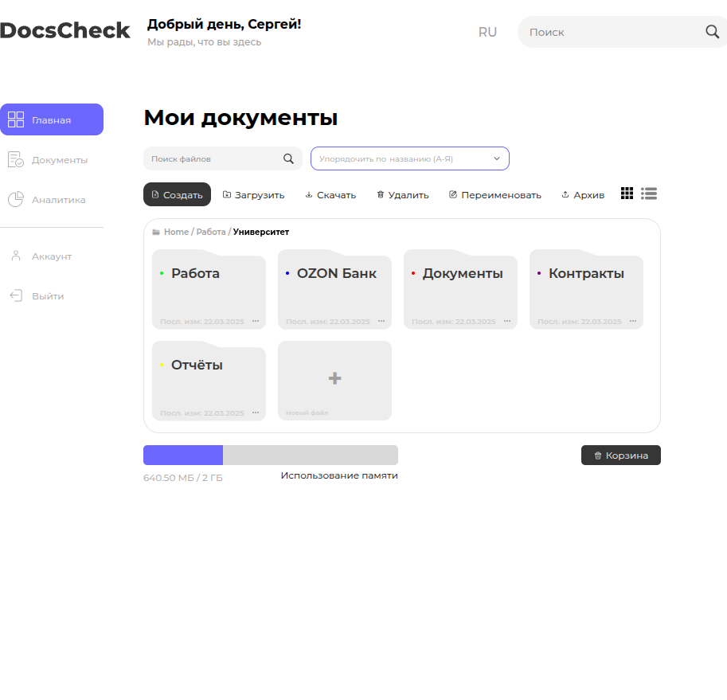
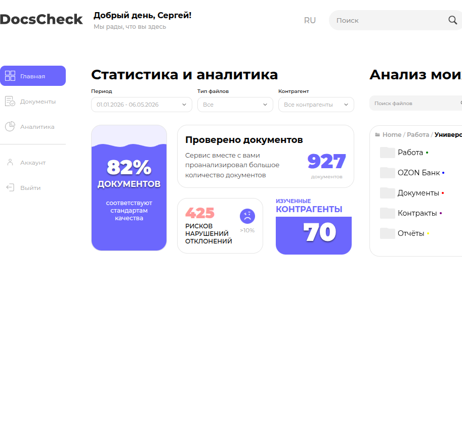

# Руководство пользователя Dokkee

Dokkee — веб-сервис проверки и анализа документов с помощью ИИ. Поддерживает форматы **PDF**, **DOCX** и **DOC** (бинарный `.doc` принимается только после пересохранения в `.docx`). Сервис выводит риски, ссылается на конкретные фрагменты текста и поддерживает уточняющий чат с ассистентом.

## Содержание

1. [Главный экран и навигация](#1-главный-экран-и-навигация)
2. [Загрузка документов](#2-загрузка-документов)
3. [Запуск анализа и настройка проверок](#3-запуск-анализа-и-настройка-проверок)
4. [Чтение результатов: риски и подсветка](#4-чтение-результатов-риски-и-подсветка)
5. [Чат с ассистентом и экспорт отчёта](#5-чат-с-ассистентом-и-экспорт-отчёта)
6. [Работа с папками и аналитикой](#6-работа-с-папками-и-аналитикой)
7. [Раздел "Аккаунт"](#7-раздел-аккаунт)
8. [Частые вопросы](#8-частые-вопросы)

---

## 1. Главный экран и навигация

После открытия сервиса вы увидите страницу "Главная" с областью загрузки документов и боковое меню слева.

Боковое меню содержит четыре основных раздела:

- **Главная** — загрузка документов и работа с анализом.
- **Документы** — файловое хранилище: папки, поиск, переименование, корзина.
- **Аналитика** — статистика по проверенным документам и контрагентам.
- **Аккаунт** — личные данные пользователя.

Кнопка **"Скрыть меню"** в правом верхнем углу шапки позволяет увеличить рабочую область — меню сворачивается до иконок.

## 2. Загрузка документов

Перетащите файлы в пунктирную область **"Загрузите файл(-ы) сюда"** или кликните по ней, чтобы открыть системный диалог выбора. Можно загрузить один или несколько файлов одновременно. **Каждый загруженный файл считается отдельной проверкой.**

Поддерживаемые форматы:

| Формат | Превью | Анализ | Примечание |
|--------|--------|--------|------------|
| `PDF`  | Да (canvas + текстовый слой) | Да | Текст должен быть выбираемым, сканы без OCR не анализируются. |
| `DOCX` | Да (HTML с заголовками, списками, таблицами, картинками) | Да | Сохраняются стили и форматирование. |
| `DOC` (бинарный) | Нет | Нет | Откройте в Word и пересохраните как `.docx`. |

После загрузки файл появляется в блоке **"Загруженные документы"** под областью загрузки. Кликнув на карточку файла, вы открываете его в области превью.

## 3. Запуск анализа и настройка проверок

Под кнопкой **"Анализ"** открывается модальное окно настроек: чекбоксы выбора типов проверок (например, проверка реквизитов, противоречий, юридических формулировок). Снимите ненужные галочки, чтобы сузить анализ и ускорить ответ.

После старта анализа в правой панели отображается **прогресс-бар** со стадиями от 0% до 99%. Окончательный ответ от ИИ дописывается посимвольно — это нормальное поведение, прогресс не зависает.

## 4. Чтение результатов: риски и подсветка

Когда анализ завершён, на превью документа появляются **цветные подсветки** фрагментов, к которым относятся найденные риски. В правой панели отображается список рисков с уровнем (Большие / Средние / Малые / Готово) и цитатой из документа.

Принципы работы с панелью рисков:

- Клик по риску в панели — **скролл превью** к нужному фрагменту.
- Наведение на подсветку в документе — **тёмная подсветка** для визуального акцента.
- Клик по подсветке — **поповер** с цитатой, объяснением и кнопкой **"Принять риск"**. После принятия риск окрашивается зелёным.
- Если у DeepSeek возникли проблемы со структурой ответа, риски всё равно будут показаны — парсер устойчив к разным форматам (markdown-блоки, JSON, синонимы полей).

## 5. Чат с ассистентом и экспорт отчёта

Под результатами анализа находится **чат с ассистентом**: задавайте уточняющие вопросы по документу, просите переформулировать пункт или объяснить риск подробнее. Чат хранится отдельно для каждого документа — переключение на другой файл сбрасывает текущий разговор только визуально.

Кнопка **"Экспорт отчёта"** формирует PDF с разделами:

1. Метаданные документа.
2. Список рисков с цитатами.
3. Полная переписка с ассистентом.

Экспорт идёт через `html2pdf.js` без обращения к серверу — отчёт скачивается локально.

## 6. Работа с папками и аналитикой

Раздел **"Документы"** — это файловое хранилище с папками, поиском, сортировкой и корзиной. Можно создавать вложенные папки, переименовывать файлы, отправлять в архив. Внизу — индикатор использования памяти (текущий объём / лимит тарифа).

Раздел **"Аналитика"** показывает агрегированную статистику за период:

- Доля документов, соответствующих стандартам качества.
- Количество проверенных документов.
- Количество обнаруженных рисков и нарушений.
- Количество изученных контрагентов.

Фильтры сверху: период, тип файлов, контрагент.

## 7. Раздел "Аккаунт"

В разделе **"Аккаунт"** отображаются данные пользователя (имя, тариф, лимит памяти). На текущем этапе раздел минимально оформлен — расширение запланировано, см. [Инструкцию администратора](ADMIN_GUIDE.md).

## 8. Частые вопросы

**Я загрузил `.doc`, и сервис его отклонил.**
Бинарный `.doc` не поддерживается в браузерной версии. Откройте файл в Word или LibreOffice и пересохраните как `.docx`.

**В PDF не выделяется текст и не появляются подсветки рисков.**
PDF должен содержать текстовый слой. Сканы без OCR не подходят. Проверьте, копируется ли текст в Adobe Reader — если нет, сначала прогоните файл через OCR (например, Acrobat OCR).

**Прогресс анализа застрял на 99%.**
Это финальная стадия — модель ещё дописывает развёрнутый ответ. Подождите, дописка идёт посимвольно из-за стриминга. Если индикатор не двигается больше двух минут, обновите страницу и запустите анализ повторно.

**Куда уходят мои документы?**
Файлы хранятся локально в браузере (в Pinia-сторе), на сервер не отправляются. На анализ в DeepSeek отправляется только **извлечённый текст**, не оригинал файла.

**Я не вижу свой ключ DeepSeek в настройках.**
Ключ задаётся администратором при развёртывании (`VUE_APP_DEEPSEEK_KEY`). Обратитесь к администратору вашей организации — см. [Инструкцию администратора](ADMIN_GUIDE.md).
